# V25 마이그레이션 ERD 문서

## 📊 개요

V25 마이그레이션에서 `glossary_term_documents` 테이블이 레거시 `documents` 테이블 대신 새로운 `files` 아키텍처를 참조하도록 변경되었습니다.

---

## 🎨 Mermaid ERD (GitHub/렌더링 가능)

```mermaid
erDiagram
    %% 사용자 및 프로젝트
    USERS ||--o{ GLOSSARY_TERMS : "creates"
    USERS ||--o{ FILES : "uploads"
    PROJECTS ||--o{ GLOSSARY_TERMS : "contains"
    PROJECTS ||--o{ PROJECT_FILES : "has"

    %% 용어집 핵심 관계 (V25 변경 사항)
    GLOSSARY_TERMS ||--o{ GLOSSARY_TERM_DOCUMENTS : "appears_in"
    FILES ||--o{ GLOSSARY_TERM_DOCUMENTS : "contains"

    %% 파일 아키텍처 (상속 구조)
    FILES ||--o| DOCUMENT_FILES : "extends (1:1)"
    FILES ||--o| VIDEO_FILES : "extends (1:1)"
    FILES ||--o{ PROJECT_FILES : "belongs_to"
    FILES ||--o{ DOCUMENT_CONTENT : "has"
    FILES ||--o{ DOCUMENT_METADATA : "has"
    FILES ||--o{ VIDEO_TRANSLATION_GLOSSARIES : "has"

    %% 번역 관계
    GLOSSARY_TERMS ||--o{ TRANSLATION_TERMS : "used_in"
    TRANSLATIONS ||--o{ TRANSLATION_TERMS : "contains"

    %% 테이블 정의
    USERS {
        uuid id PK
        string username
        string email
    }

    PROJECTS {
        uuid id PK
        string name
        string description
    }

    GLOSSARY_TERMS {
        uuid id PK
        uuid user_id FK "NOT NULL"
        uuid project_id FK "NULLABLE"
        string korean_term "NOT NULL, UNIQUE(user_id, korean_term)"
        string english_term
        string vietnamese_term
        text definition "NOT NULL"
        string status "NOT NULL"
        timestamp created_at
    }

    FILES {
        uuid id PK
        uuid user_id FK "NOT NULL, CASCADE"
        string file_type "NOT NULL (DOCUMENT/VIDEO/AUDIO)"
        string original_filename
        string stored_filename "UNIQUE"
        string file_path
        bigint file_size
        string mime_type
        string status
        timestamp upload_date
    }

    GLOSSARY_TERM_DOCUMENTS {
        uuid term_id PK,FK "CASCADE"
        uuid file_id PK,FK "CASCADE (V25: document_id → file_id)"
        timestamp created_at "DEFAULT CURRENT_TIMESTAMP"
    }

    DOCUMENT_FILES {
        uuid id PK,FK "CASCADE (1:1 with files)"
        string language
        int page_count
        int word_count
        int character_count
        boolean is_analyzed
    }

    VIDEO_FILES {
        uuid id PK,FK "CASCADE (1:1 with files)"
        string video_codec
        string audio_codec
        int duration_seconds
        int width
        int height
    }

    PROJECT_FILES {
        uuid project_id PK,FK "CASCADE"
        uuid file_id PK,FK "CASCADE"
        timestamp added_at
    }

    TRANSLATION_TERMS {
        uuid id PK
        uuid glossary_term_id FK "CASCADE"
        uuid translation_id FK "CASCADE"
    }

    TRANSLATIONS {
        uuid id PK
        text source_text
        text translated_text
    }

    DOCUMENT_CONTENT {
        uuid id PK
        uuid file_id FK "NO ACTION"
        text content
    }

    DOCUMENT_METADATA {
        uuid id PK
        uuid file_id FK "NO ACTION"
        jsonb metadata
    }

    VIDEO_TRANSLATION_GLOSSARIES {
        uuid id PK
        uuid file_id FK "NO ACTION"
    }
```



---

## 🖼️ ASCII Box Diagram

### 전체 시스템 구조

```
┌─────────────────────────────────────────────────────────────────────────────────────┐
│                         V25 마이그레이션 핵심 변경 사항                                 │
│                  glossary_term_documents가 files를 참조하도록 변경                      │
└─────────────────────────────────────────────────────────────────────────────────────┘

                    ┌──────────────┐
                    │    USERS     │
                    ├──────────────┤
                    │ id (PK)      │
                    │ username     │
                    │ email        │
                    └──────┬───────┘
                           │ 1
                           │ creates/uploads
                           │
           ┌───────────────┼───────────────┐
           │               │               │
           │ N             │ N             │
    ┌──────▼────────┐      │        ┌─────▼──────┐
    │ GLOSSARY_TERMS│      │        │   FILES    │
    ├───────────────┤      │        ├────────────┤
    │ id (PK)       │      │        │ id (PK)    │
    │ user_id (FK)  │      │        │ user_id    │◄─── CASCADE DELETE
    │ project_id    │      │        │ file_type  │
    │ korean_term   │      │        │ file_path  │
    │ english_term  │      │        │ file_size  │
    │ definition    │      │        │ status     │
    │ status        │      │        └─────┬──────┘
    └───────┬───────┘      │              │
            │              │              │
            │ 1            │              │ 1
            │              │              │
            │         ┌────▼────┐         │
            │         │ PROJECTS│         │
            │         ├─────────┤         │
            │         │ id (PK) │         │
            └────────►│ name    │◄────┐   │
                  N   └─────────┘   N │   │
                                      │   │
                                 ┌────▼───▼────┐
                                 │PROJECT_FILES│
                                 ├─────────────┤
                                 │project_id PK│
                                 │file_id PK   │
                                 └─────────────┘
```

### V25 핵심: M:N 관계 (Many-to-Many)

```
    ┌────────────────┐        ┌──────────────────────────┐        ┌──────────────┐
    │ GLOSSARY_TERMS │        │ GLOSSARY_TERM_DOCUMENTS  │        │    FILES     │
    ├────────────────┤        ├──────────────────────────┤        ├──────────────┤
    │ id (PK)        │───────►│ term_id (PK, FK)         │        │ id (PK)      │
    │ korean_term    │   1    │ file_id (PK, FK) ✨NEW   │◄───────│ file_type    │
    │ english_term   │        │ created_at               │   1    │ file_path    │
    │ definition     │        └──────────────────────────┘        └──────────────┘
    └────────────────┘                   │                                │
            │                            │                                │
            │ 1                          │ M:N 중간 테이블                  │ 1
            │                            │ (Many-to-Many)                 │
            │                            │                                │
            │                            │                                │
            │                     CASCADE DELETE                   CASCADE DELETE
            │                     ⬇ 용어 삭제 시                    ⬇ 파일 삭제 시
            │                     관계 레코드 자동 삭제               관계 레코드 자동 삭제
            │                                                              │
            │                                                              │
            └──────────────────────────────────────────────────────────────┘
```

**동작 예시:**

```
용어 "API"가 3개 파일에 등장하는 경우:

glossary_term_documents:
+--------+----------+---------------------+
| term_id| file_id  | created_at          |
+--------+----------+---------------------+
| API-id | doc1-id  | 2025-11-20 10:00:00 |
| API-id | doc2-id  | 2025-11-20 10:05:00 |
| API-id | doc3-id  | 2025-11-20 10:10:00 |
+--------+----------+---------------------+

파일 "doc1.pdf"가 3개 용어를 포함하는 경우:

glossary_term_documents:
+--------+----------+---------------------+
| term_id| file_id  | created_at          |
+--------+----------+---------------------+
| API-id | doc1-id  | 2025-11-20 10:00:00 |
| REST-id| doc1-id  | 2025-11-20 10:00:00 |
| HTTP-id| doc1-id  | 2025-11-20 10:00:00 |
+--------+----------+---------------------+
```

### 파일 아키텍처: 상속 구조 (Table-Per-Type)

```
                         ┌──────────────┐
                         │    FILES     │
                         │  (부모 테이블)  │
                         ├──────────────┤
                         │ id (PK)      │
                         │ file_type    │ ◄─── DOCUMENT/VIDEO/AUDIO
                         │ file_path    │
                         │ file_size    │
                         └──────┬───────┘
                                │
                  ┌─────────────┼─────────────┐
                  │ 1:1         │ 1:1         │ 1:1
                  │ extends     │ extends     │
           ┌──────▼──────┐  ┌───▼────────┐   │
           │DOCUMENT_FILES│  │VIDEO_FILES │   │
           ├─────────────┤  ├────────────┤   │
           │ id (PK, FK) │  │ id (PK, FK)│   │ (미래: AUDIO_FILES)
           │ language    │  │ duration   │   │
           │ page_count  │  │ video_codec│   │
           │ word_count  │  │ width      │   │
           │ is_analyzed │  │ height     │   │
           └─────────────┘  └────────────┘   │
                                              │
                                              ▼
                                        (확장 가능)
```

**구현 방식:**
- **1:1 관계**: `document_files.id = files.id` (같은 PK 공유)
- **file_type 구분**: `files.file_type IN ('DOCUMENT', 'VIDEO', 'AUDIO')`
- **CASCADE DELETE**: `files` 삭제 시 `document_files` 또는 `video_files`도 자동 삭제

### 번역 관계 (Translation System)

```
    ┌────────────────┐        ┌──────────────────┐        ┌──────────────┐
    │ GLOSSARY_TERMS │        │ TRANSLATION_TERMS│        │ TRANSLATIONS │
    ├────────────────┤        ├──────────────────┤        ├──────────────┤
    │ id (PK)        │───────►│ id (PK)          │        │ id (PK)      │
    │ korean_term    │   1    │ glossary_term_id │        │ source_text  │
    │ english_term   │        │ translation_id   │◄───────│ translated   │
    │ vietnamese_term│        └──────────────────┘   1    └──────────────┘
    └────────────────┘                 │
                                       │ M:N
                                       │ (용어가 여러 번역에 사용됨)
```

---

## 📋 테이블 상세 정보

### `glossary_term_documents` (V25 변경)

#### 컬럼 구조

| 컬럼명 | 데이터 타입 | Nullable | Default | 설명 |
|--------|------------|----------|---------|------|
| **term_id** | UUID | NOT NULL | - | 용어집 ID (glossary_terms 참조) |
| **file_id** | UUID | NOT NULL | - | ✨ **V25 신규**: 파일 ID (files 참조) |
| **created_at** | TIMESTAMP WITH TIME ZONE | NOT NULL | CURRENT_TIMESTAMP | 생성 일시 |

#### Primary Key

```sql
PRIMARY KEY (term_id, file_id)
```

#### Foreign Keys

| FK 이름 | 컬럼 | 참조 테이블 | 참조 컬럼 | DELETE 규칙 |
|---------|------|------------|----------|-------------|
| `fk_glossary_term_documents_term` | `term_id` | `glossary_terms` | `id` | **CASCADE** |
| `fk_glossary_term_documents_file` | `file_id` | `files` | `id` | **CASCADE** |

#### Indexes

```sql
CREATE INDEX idx_glossary_term_documents_term_id ON glossary_term_documents(term_id);
CREATE INDEX idx_glossary_term_documents_file_id ON glossary_term_documents(file_id);
```

### `glossary_terms`

| 컬럼명 | 데이터 타입 | 설명 |
|--------|------------|------|
| `id` | UUID | Primary Key |
| `user_id` | UUID | 생성자 (FK → users) |
| `project_id` | UUID | 소속 프로젝트 (FK → projects, nullable) |
| `korean_term` | VARCHAR(255) | 한글 용어 (NOT NULL, UNIQUE with user_id) |
| `english_term` | VARCHAR(255) | 영문 용어 |
| `vietnamese_term` | VARCHAR(255) | 베트남어 용어 |
| `definition` | TEXT | 용어 정의 (NOT NULL) |
| `status` | VARCHAR(20) | 상태 (NOT NULL) |
| `created_at` | TIMESTAMP | 생성 일시 |

### `files`

| 컬럼명 | 데이터 타입 | 설명 |
|--------|------------|------|
| `id` | UUID | Primary Key |
| `user_id` | UUID | 업로더 (FK → users, CASCADE) |
| `file_type` | VARCHAR(20) | 파일 타입 (DOCUMENT/VIDEO/AUDIO) |
| `original_filename` | VARCHAR(255) | 원본 파일명 |
| `stored_filename` | VARCHAR(255) | 저장된 파일명 (UNIQUE) |
| `file_path` | VARCHAR(500) | 파일 경로 |
| `file_size` | BIGINT | 파일 크기 (바이트) |
| `mime_type` | VARCHAR(100) | MIME 타입 |
| `status` | VARCHAR(20) | 상태 |
| `upload_date` | TIMESTAMP WITH TIME ZONE | 업로드 일시 |

### `document_files` (1:1 extends files)

| 컬럼명 | 데이터 타입 | 설명 |
|--------|------------|------|
| `id` | UUID | Primary & Foreign Key → files(id) |
| `language` | VARCHAR(10) | 문서 언어 |
| `page_count` | INTEGER | 페이지 수 |
| `word_count` | INTEGER | 단어 수 |
| `character_count` | INTEGER | 문자 수 |
| `is_analyzed` | BOOLEAN | 분석 여부 (default: false) |

### `video_files` (1:1 extends files)

| 컬럼명 | 데이터 타입 | 설명 |
|--------|------------|------|
| `id` | UUID | Primary & Foreign Key → files(id) |
| `video_codec` | VARCHAR(50) | 비디오 코덱 |
| `audio_codec` | VARCHAR(50) | 오디오 코덱 |
| `duration_seconds` | INTEGER | 재생 시간 (초) |
| `width` | INTEGER | 가로 해상도 |
| `height` | INTEGER | 세로 해상도 |

---

## 📊 상세 관계 매트릭스

| FROM 테이블 | FROM 컬럼 | TO 테이블 | TO 컬럼 | 관계 타입 | DELETE 규칙 | 설명 |
|------------|----------|----------|---------|----------|-------------|------|
| **glossary_term_documents** | `term_id` | `glossary_terms` | `id` | **M:N** | **CASCADE** | ✨ 용어 삭제 시 모든 파일 연결 제거 |
| **glossary_term_documents** | `file_id` | `files` | `id` | **M:N** | **CASCADE** | ✨ **V25 신규**: 파일 삭제 시 모든 용어 연결 제거 |
| `glossary_terms` | `user_id` | `users` | `id` | 1:N | NO ACTION | 사용자가 용어 생성 |
| `glossary_terms` | `project_id` | `projects` | `id` | 1:N | NO ACTION | 프로젝트에 속한 용어 (nullable) |
| `files` | `user_id` | `users` | `id` | 1:N | **CASCADE** | 사용자 삭제 시 파일도 삭제 |
| `document_files` | `id` | `files` | `id` | **1:1** | **CASCADE** | 문서 파일 상속 (extends) |
| `video_files` | `id` | `files` | `id` | **1:1** | **CASCADE** | 비디오 파일 상속 (extends) |
| `project_files` | `project_id` | `projects` | `id` | M:N | **CASCADE** | 프로젝트-파일 연결 |
| `project_files` | `file_id` | `files` | `id` | M:N | **CASCADE** | 프로젝트-파일 연결 |
| `translation_terms` | `glossary_term_id` | `glossary_terms` | `id` | M:N | **CASCADE** | 용어-번역 연결 |
| `translation_terms` | `translation_id` | `translations` | `id` | M:N | **CASCADE** | 번역-용어 연결 |
| `document_content` | `file_id` | `files` | `id` | 1:N | NO ACTION | 파일 내용 저장 |
| `document_metadata` | `file_id` | `files` | `id` | 1:N | NO ACTION | 파일 메타데이터 |

---

## 🎯 카디널리티 (Cardinality) 설명

### Many-to-Many (M:N) 관계

#### 1. `glossary_term_documents` (핵심! V25 변경)

```
GLOSSARY_TERMS  ─────  M:N  ─────  FILES
      (1)                              (1)
       │                                │
       │                                │
       └──────► term_id, file_id ◄──────┘
            (M)  중간 테이블  (M)
```

**의미:**
- 한 용어는 여러 파일에 등장 가능
- 한 파일은 여러 용어 포함 가능

**예시:**
```sql
-- 용어 "API"는 여러 파일에 등장
SELECT f.original_filename
FROM files f
JOIN glossary_term_documents gtd ON f.id = gtd.file_id
WHERE gtd.term_id = 'API-uuid';

-- 결과: doc1.pdf, doc2.pdf, doc3.pdf

-- 파일 "doc1.pdf"는 여러 용어 포함
SELECT gt.korean_term
FROM glossary_terms gt
JOIN glossary_term_documents gtd ON gt.id = gtd.term_id
WHERE gtd.file_id = 'doc1-uuid';

-- 결과: API, REST, HTTP
```

#### 2. `project_files`

```
PROJECTS  ─────  M:N  ─────  FILES
```

**의미:**
- 한 프로젝트는 여러 파일 포함
- 한 파일은 여러 프로젝트에 속할 수 있음

#### 3. `translation_terms`

```
GLOSSARY_TERMS  ─────  M:N  ─────  TRANSLATIONS
```

**의미:**
- 한 용어가 여러 번역에 사용
- 한 번역이 여러 용어 포함

### One-to-One (1:1) 관계 (상속)

```
FILES (부모)
  │
  ├──► DOCUMENT_FILES (자식, file_type = 'DOCUMENT')
  │
  └──► VIDEO_FILES (자식, file_type = 'VIDEO')
```

**구현 방식:** Table-Per-Type Inheritance

**특징:**
- `document_files.id = files.id` (같은 PK 공유)
- `files.file_type`으로 타입 구분
- CASCADE DELETE로 일관성 유지

**쿼리 예시:**
```sql
-- 문서 파일 조회 (JOIN 필요)
SELECT f.*, df.page_count, df.word_count
FROM files f
JOIN document_files df ON f.id = df.id
WHERE f.file_type = 'DOCUMENT';

-- 비디오 파일 조회 (JOIN 필요)
SELECT f.*, vf.duration_seconds, vf.width, vf.height
FROM files f
JOIN video_files vf ON f.id = vf.id
WHERE f.file_type = 'VIDEO';
```

### One-to-Many (1:N) 관계

```
USERS ─────► GLOSSARY_TERMS (한 사용자가 여러 용어 생성)
USERS ─────► FILES (한 사용자가 여러 파일 업로드)
PROJECTS ─────► GLOSSARY_TERMS (한 프로젝트가 여러 용어 포함)
```

---

## ⚠️ DELETE 정책 상세

### CASCADE DELETE

**동작:** 부모 삭제 시 자식도 자동 삭제

**적용 대상:**
- `glossary_term_documents` (term_id, file_id)
- `files` (user_id)
- `document_files` (id)
- `video_files` (id)
- `project_files` (project_id, file_id)
- `translation_terms` (glossary_term_id, translation_id)

**예시:**
```sql
-- 파일 삭제
DELETE FROM files WHERE id = '123e4567...';

-- ✅ 자동으로 함께 삭제되는 레코드:
-- 1. glossary_term_documents (file_id = '123e4567...')
-- 2. document_files (id = '123e4567...') 또는 video_files
-- 3. project_files (file_id = '123e4567...')

-- 용어 삭제
DELETE FROM glossary_terms WHERE id = 'abc123...';

-- ✅ 자동으로 함께 삭제되는 레코드:
-- 1. glossary_term_documents (term_id = 'abc123...')
-- 2. translation_terms (glossary_term_id = 'abc123...')
```

### NO ACTION

**동작:** 부모 삭제 시 자식이 존재하면 에러 발생

**적용 대상:**
- `glossary_terms` (user_id, project_id)
- `document_content` (file_id)
- `document_metadata` (file_id)
- `video_translation_glossaries` (file_id)

**예시:**
```sql
-- ❌ 에러 발생 케이스
DELETE FROM users WHERE id = 'user-123';
-- ERROR: update or delete on table "users" violates foreign key constraint
-- DETAIL: Key (id)=(user-123) is still referenced from table "glossary_terms"

-- ✅ 올바른 순서
DELETE FROM glossary_terms WHERE user_id = 'user-123';  -- 먼저 자식 삭제
DELETE FROM users WHERE id = 'user-123';                -- 그 다음 부모 삭제
```

---

## 🔄 V25 마이그레이션 Before & After

### Before V25 (Legacy)

```sql
CREATE TABLE glossary_term_documents (
    term_id UUID NOT NULL,
    document_id UUID NOT NULL,  -- ❌ documents 테이블 참조 (삭제됨)
    created_at TIMESTAMP WITH TIME ZONE DEFAULT CURRENT_TIMESTAMP,
    PRIMARY KEY (term_id, document_id),
    FOREIGN KEY (term_id) REFERENCES glossary_terms(id) ON DELETE CASCADE,
    FOREIGN KEY (document_id) REFERENCES documents(id) ON DELETE CASCADE
);
```

**문제점:**
- `documents` 테이블이 V24에서 삭제됨
- 새로운 `files` 아키텍처와 호환 불가
- 외래 키 무결성 위반

### After V25 (Current)

```sql
CREATE TABLE glossary_term_documents (
    term_id UUID NOT NULL,
    file_id UUID NOT NULL,  -- ✅ files 테이블 참조 (새 아키텍처)
    created_at TIMESTAMP WITH TIME ZONE NOT NULL DEFAULT CURRENT_TIMESTAMP,
    PRIMARY KEY (term_id, file_id),
    CONSTRAINT fk_glossary_term_documents_term
        FOREIGN KEY (term_id) REFERENCES glossary_terms(id) ON DELETE CASCADE,
    CONSTRAINT fk_glossary_term_documents_file
        FOREIGN KEY (file_id) REFERENCES files(id) ON DELETE CASCADE
);

CREATE INDEX idx_glossary_term_documents_term_id ON glossary_term_documents(term_id);
CREATE INDEX idx_glossary_term_documents_file_id ON glossary_term_documents(file_id);
```

**개선점:**
- ✅ 새로운 `files` 아키텍처와 완벽히 호환
- ✅ 인덱스 추가로 성능 최적화
- ✅ CASCADE DELETE로 참조 무결성 보장
- ✅ 명시적인 제약 조건 이름 (유지보수 용이)

### 마이그레이션 전략

**데이터 확인:**
```sql
SELECT COUNT(*) FROM glossary_term_documents;
-- 결과: 0 rows (데이터 없음)
```

**선택한 전략: DROP & RECREATE**
```sql
-- Step 1: 기존 테이블 삭제 (데이터 0건이므로 안전)
DROP TABLE IF EXISTS glossary_term_documents CASCADE;

-- Step 2: 새 스키마로 재생성
CREATE TABLE glossary_term_documents (
    term_id UUID NOT NULL,
    file_id UUID NOT NULL,  -- document_id → file_id 변경
    created_at TIMESTAMP WITH TIME ZONE NOT NULL DEFAULT CURRENT_TIMESTAMP,
    PRIMARY KEY (term_id, file_id),
    CONSTRAINT fk_glossary_term_documents_term
        FOREIGN KEY (term_id) REFERENCES glossary_terms(id) ON DELETE CASCADE,
    CONSTRAINT fk_glossary_term_documents_file
        FOREIGN KEY (file_id) REFERENCES files(id) ON DELETE CASCADE
);

-- Step 3: 인덱스 생성
CREATE INDEX idx_glossary_term_documents_term_id ON glossary_term_documents(term_id);
CREATE INDEX idx_glossary_term_documents_file_id ON glossary_term_documents(file_id);
```

**장점:**
- ✅ 깔끔한 스키마 재생성
- ✅ 복잡한 ALTER 불필요
- ✅ 데이터 손실 없음 (0건)
- ✅ 간결하고 이해하기 쉬운 코드

---

## 💡 설계 포인트 요약

### 1. 정규화 (Normalization)

- **M:N 관계**: 중간 테이블(`glossary_term_documents`)로 정규화
- **중복 방지**: Primary Key로 `(term_id, file_id)` 조합 사용
- **데이터 무결성**: Foreign Key 제약 조건 강제

### 2. 상속 (Inheritance)

- **패턴**: Table-Per-Type Inheritance
- **구조**: `files` (부모) ← `document_files`, `video_files` (자식)
- **확장성**: 새로운 파일 타입 추가 용이 (예: `audio_files`)

### 3. 참조 무결성 (Referential Integrity)

- **CASCADE DELETE**: 고아 레코드 자동 방지
- **NO ACTION**: 중요 데이터 보호 (명시적 삭제 요구)
- **일관성 보장**: FK 제약 조건으로 데이터 일관성 유지

### 4. 성능 최적화 (Performance)

- **인덱스**: 자주 조회하는 FK 컬럼에 인덱스 생성
  - `idx_glossary_term_documents_term_id`
  - `idx_glossary_term_documents_file_id`
- **복합 인덱스**: Primary Key가 자동으로 인덱스 역할

### 5. 확장성 (Scalability)

- **file_type 활용**: 새로운 파일 타입 추가 가능
- **유연한 구조**: M:N 관계로 복잡한 비즈니스 로직 지원
- **미래 대비**: 테이블 구조 변경 최소화

---

## ✅ 검증 체크리스트

동료 검토 시 다음 항목을 확인해주세요:

### 스키마 정합성
- [ ] `glossary_term_documents`가 `files` 테이블과 올바르게 연결되어 있는가?
- [ ] `glossary_term_documents`가 `glossary_terms` 테이블과 올바르게 연결되어 있는가?
- [ ] Primary Key가 `(term_id, file_id)` 복합키로 설정되어 있는가?

### 인덱스
- [ ] `idx_glossary_term_documents_term_id` 인덱스가 생성되어 있는가?
- [ ] `idx_glossary_term_documents_file_id` 인덱스가 생성되어 있는가?
- [ ] 조회 성능에 문제가 없는가?

### CASCADE 정책
- [ ] 파일 삭제 시 `glossary_term_documents` 레코드가 자동 삭제되는가?
- [ ] 용어 삭제 시 `glossary_term_documents` 레코드가 자동 삭제되는가?
- [ ] 고아 레코드(orphan records)가 발생하지 않는가?

### 데이터 무결성
- [ ] `(term_id, file_id)` 조합으로 중복이 방지되는가?
- [ ] `created_at`에 기본값이 올바르게 설정되어 있는가?
- [ ] 외래 키 제약 조건이 올바르게 동작하는가?

### 코드 업데이트
- [ ] JPA Entity 클래스 업데이트 필요 (GlossaryTermDocument)
  - `documentId` → `fileId` 변경
  - `@JoinColumn` 수정
- [ ] Repository 메서드 업데이트 필요
  - `findByDocumentId()` → `findByFileId()` 변경
- [ ] Service 레이어 업데이트 필요
  - `GlossaryService`에서 `document_id` → `file_id` 변경
- [ ] DTO 클래스 업데이트 필요
  - Response/Request DTO에서 필드명 변경

### 마이그레이션 안전성
- [ ] 기존 데이터가 0건임을 확인했는가?
- [ ] 마이그레이션 롤백 스크립트가 준비되어 있는가?
- [ ] Flyway 마이그레이션이 성공적으로 실행되었는가?

---

## 📚 관련 문서

- [V25 Migration SQL](../src/main/resources/db/migration/V25__add_glossary_term_documents_file_fk.sql)
- [Files Architecture Overview](./FILES_ARCHITECTURE.md) (작성 예정)
- [Database Migration Guide](../../DATABASE_MIGRATION_GUIDE.md)

---

## 🔗 유용한 쿼리

### 용어가 포함된 모든 파일 조회

```sql
SELECT
    gt.korean_term,
    gt.english_term,
    f.original_filename,
    f.file_type,
    gtd.created_at
FROM glossary_terms gt
JOIN glossary_term_documents gtd ON gt.id = gtd.term_id
JOIN files f ON gtd.file_id = f.id
WHERE gt.korean_term = 'API'
ORDER BY gtd.created_at DESC;
```

### 파일에 포함된 모든 용어 조회

```sql
SELECT
    f.original_filename,
    gt.korean_term,
    gt.english_term,
    gt.definition
FROM files f
JOIN glossary_term_documents gtd ON f.id = gtd.file_id
JOIN glossary_terms gt ON gtd.term_id = gt.id
WHERE f.original_filename = 'document.pdf'
ORDER BY gt.korean_term;
```

### 특정 사용자의 용어-파일 관계 조회

```sql
SELECT
    u.username,
    gt.korean_term,
    COUNT(DISTINCT gtd.file_id) as file_count,
    STRING_AGG(DISTINCT f.original_filename, ', ') as files
FROM users u
JOIN glossary_terms gt ON u.id = gt.user_id
LEFT JOIN glossary_term_documents gtd ON gt.id = gtd.term_id
LEFT JOIN files f ON gtd.file_id = f.id
WHERE u.username = 'testuser'
GROUP BY u.username, gt.korean_term
ORDER BY file_count DESC;
```

### 고아 레코드 확인 (참조 무결성 검증)

```sql
-- file_id가 files 테이블에 존재하지 않는 레코드
SELECT gtd.*
FROM glossary_term_documents gtd
LEFT JOIN files f ON gtd.file_id = f.id
WHERE f.id IS NULL;

-- term_id가 glossary_terms 테이블에 존재하지 않는 레코드
SELECT gtd.*
FROM glossary_term_documents gtd
LEFT JOIN glossary_terms gt ON gtd.term_id = gt.id
WHERE gt.id IS NULL;

-- 결과가 0건이어야 정상
```

---

**작성일**: 2025-11-21
**버전**: V25
**작성자**: NEXUS Team
